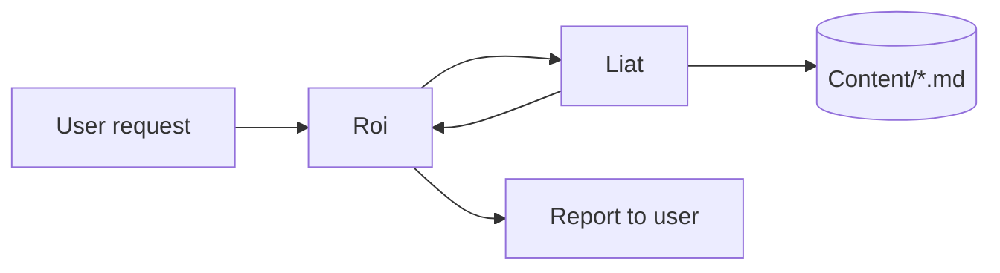
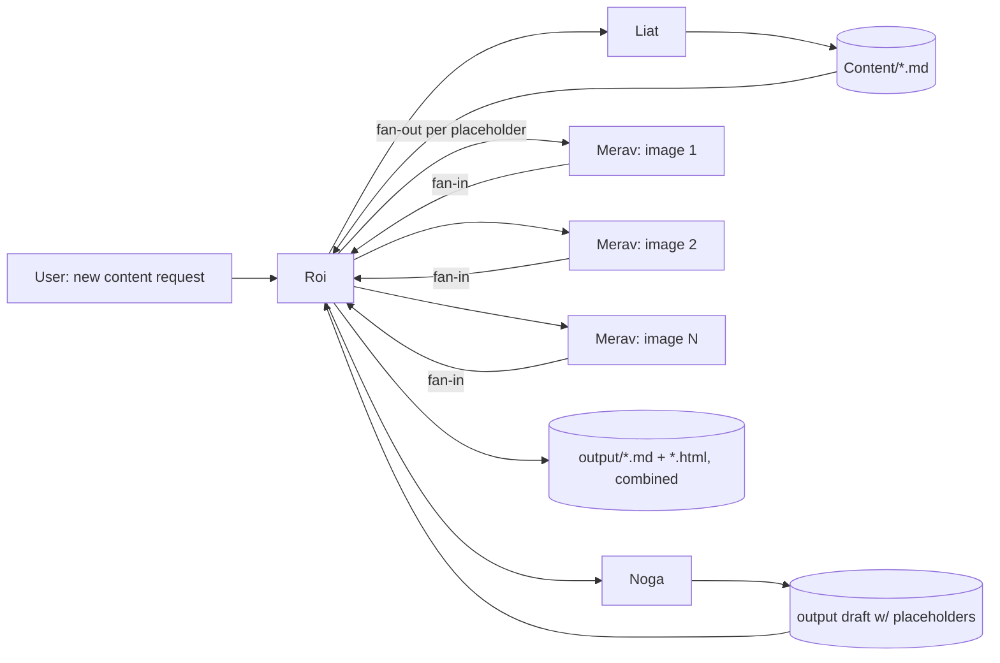
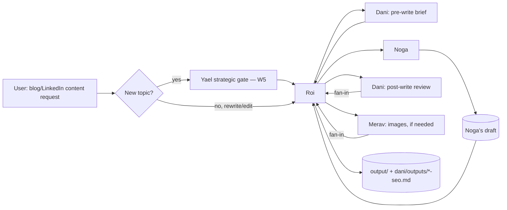
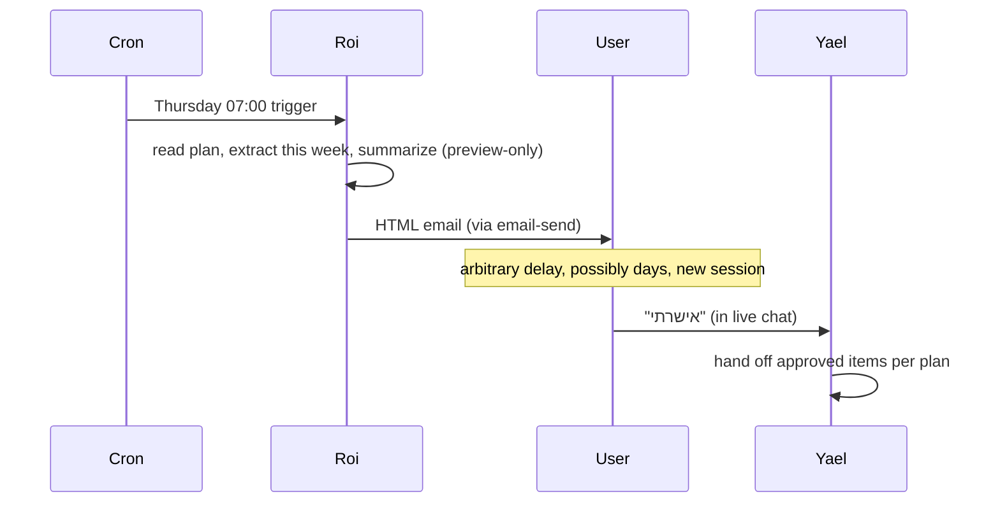

# Phase 3 — Workflow Catalog

Every workflow CreativeAgent currently supports, as implemented today (before any redesign). This catalog is the input to Phase 6's config schema — each workflow here should become expressible as data, not prose, without changing what it does.

---

## W1. Research-only request

**Objective**: find a quality, sourced article/trend on a marketing/automation topic.
**Deliverables**: one file in `Content/`, a 1–2 sentence summary, source link.
**Agents**: Liat only.
**Order**: single step.
**Dependencies**: none.
**Branches**: none.
**Retry**: Liat checks her own 30-day memory log before searching; no automated retry on search failure today.
**Completion criteria**: file saved, summary + link returned to Roi.

---

## W2. Research → write → visual (full content pipeline)

**Objective**: produce a finished, illustrated piece of content from a bare topic.
**Deliverables**: `Content/*.md` (Liat), `output/*.md`+`*.html` (Noga), image file(s) (Merav), final combined `output/` files.
**Agents**: Liat → Noga → Merav (conditional on images being needed) → Roi (combine).
**Order**: strictly sequential for Liat→Noga; Merav can run once Noga's placeholder list exists; if multiple images are needed, Merav's calls fan out in parallel.
**Dependencies**: Noga depends on Liat's file; Merav depends on Noga's `{{IMAGE_NEEDED}}` list; final combine depends on all Merav outputs completing.
**Branches**: if the user only asked to "find an article," the workflow terminates after Liat (this is W1, not W2 — the branch point is the *initial request type*, decided once, not re-evaluated mid-run).
**Retry**: none automated. If Merav's generation fails for one image, no defined recovery today beyond Roi noticing and reporting it.
**Completion criteria**: `output/<name>.md` and `.html` exist with all placeholders replaced by real images.

---

## W3. SEO-gated content pipeline (blog/website or LinkedIn only)

**Objective**: same as W2, but for content where organic search matters, with SEO research folded into the brief before writing and a post-write SEO review after.
**Deliverables**: Dani's pre-write brief (verbal, folded into Noga's brief by Roi), Noga's draft, Dani's `dani/outputs/<name>-seo.md` package, Merav's images if needed.
**Agents**: (optional Liat) → Dani (pass 1) → Noga → (optional Merav, fan-out) → Dani (pass 2) → Roi (combine).
**Order**: Dani pass 1 must complete before Noga starts (his brief feeds her prompt). Dani pass 2 requires Noga's finished draft. Merav can run in parallel with Dani pass 2, since both only depend on Noga's output, not on each other.
**Dependencies**: this is the clearest case in the whole system of a **two-pass dependency on the same agent** — Dani is invoked twice, at different points in the same workflow, with different inputs each time. Today this is held together entirely by Roi remembering to do so; nothing structurally enforces the second Dani pass happens.
**Branches**: if the topic is brand-new (not a rewrite), Yael's strategic gate (W5) must resolve *before* this workflow starts at all — that's a pre-condition, not a branch inside W3.
**Retry**: none automated.
**Completion criteria**: Dani's SEO package exists and references the actual final draft; Roi's combined report includes text + images + SEO package.

---

## W4. Instagram-specific content (Noga + Gefen)

**Objective**: an Instagram post with platform-specific tactical guidance baked in.
**Deliverables**: Gefen's verbal pre-write brief (format/hook/hashtags/timing), Noga's caption, Gefen's optional post-write review.
**Agents**: Gefen (pre) → Noga → Gefen (post, optional).
**Order**: Gefen's brief must precede Noga; the post-write review is optional and only runs if separately requested.
**Dependencies**: Noga depends on Gefen's brief being folded into her prompt by Roi.
**Branches**: Gefen only runs at all if explicitly requested (by the user) or recommended by Yael and acted on by Roi — unlike Dani, there is no automatic trigger.
**Retry**: none.
**Completion criteria**: caption saved to `output/`; Gefen's notes relayed verbally, never saved to a file.

---

## W5. Yael's strategic gate

**Objective**: confirm a brand-new content topic fits the business strategy before any production work starts.
**Deliverables**: one of three verdicts (fits / needs adjustment / needs a new strategic move).
**Agents**: Yael only.
**Order**: single step, always *before* W2/W3/W4 when the topic is new.
**Dependencies**: reads `yael/strategy.md` and checks whether the topic is already pre-approved in an existing monthly plan (`yael/outputs/`) — if so, this gate is skipped entirely (not re-run for already-approved topics).
**Branches**: a "needs a new strategic move" verdict must be surfaced to the user, never silently blocked or silently proceeded past.
**Retry**: none.
**Completion criteria**: a verdict is returned; production work is blocked on it only when the verdict is negative-or-conditional.

---

## W6. Monthly content planning

**Objective**: build a full month's content calendar across social/newsletter/website, mapped to business goals.
**Deliverables**: `yael/outputs/<YYYY-MM>-content-plan.md` + `.docx`.
**Agents**: Yael only (reads Airtable read-only, scans other agents' output folders to avoid repeating topics, calls `docx-export`).
**Order**: single agent, internally multi-step (read strategy → check Airtable → scan folders → build cadence framework → fill with items → save `.md` → convert to `.docx`).
**Dependencies**: none external; internally, the `.docx` conversion step depends on the `.md` being finished.
**Branches**: none.
**Retry**: none defined; `docx-export` is a deterministic script call, so failure would be a hard stop, not a silent skip.
**Completion criteria**: both files exist and are reported back.

---

## W7. Weekly plan email & approval gate

**Objective**: preview the upcoming week's approved plan items to the user by email, then wait for explicit chat approval before production starts.
**Deliverables**: an HTML email (via `email-send`), and — after approval — the actual dispatch of W2/W3/W4/etc. for that week's items.
**Agents**: Roi (preview-only, explicitly forbidden from dispatching production agents in this mode) → [time passes, a new session] → Yael (only after user says "אישרתי").
**Order**: this is CreativeAgent's **only existing example of a workflow that spans more than one session**, gated by an external event (cron) and a human approval that can arrive arbitrarily later.
**Dependencies**: requires a monthly plan already covering the upcoming week; if none exists, or `.env` vars are missing, the run **skips quietly** rather than failing loudly or inventing content.
**Branches**: no plan for the week → skip. Plan exists → send preview → wait indefinitely for approval.
**Retry**: none — a skipped run is not automatically retried; the next weekly cron simply tries again a week later.
**Completion criteria**: for the preview half, "email sent" (or "skipped, and why"). For the approval half, "Yael dispatched with the approved week's items" — this second half currently has no defined "done" signal at all, which Phase 5 addresses.

---

## W8. Publish report → content log

**Objective**: record a now-live article in the existing-content Airtable table.
**Deliverables**: one new Airtable record.
**Agents**: Dani only.
**Order**: single step, triggered by a distinct user signal ("it's live") — not part of W2/W3.
**Dependencies**: looks for a matching local file to source title/summary; falls back to `WebFetch` on the live URL.
**Branches**: category selection may be ambiguous — flagged in the report, not blocked on.
**Retry**: none; explicitly **no duplicate check** — reporting the same link twice creates two records by design (accepted trade-off, documented as intentional).
**Completion criteria**: record created, fields reported back for manual correction if needed.

---

## W9. Standalone single-agent consults

**Objective**: a family of workflows that are all "dispatch one specialist directly for one deliverable," without any pipeline.
**Members**: Dani's five standalone SEO skills (technical audit, content refresh, competitor analysis, content planning, strategy advisor), Merav's direct image generation, Liat's direct research (=W1), Gefen's profile-structure recommendations.
**Deliverables**: varies per skill, each saved to that agent's own `outputs/` subfolder.
**Agents**: exactly one, always.
**Order**: single step.
**Dependencies**: some (content-refresh, technical-audit) optionally use Search Console data if configured; strategy-advisor requires at least one prior SEO report to exist.
**Branches**: none.
**Retry**: none.
**Completion criteria**: file saved + reported.

---

## W10. Newsletter draft-to-Smoove

**Objective**: turn a finished newsletter into a sendable draft in the ESP, without ever sending it.
**Deliverables**: a draft campaign in Smoove (external system), reported by campaign ID.
**Agents**: Noga only, and only as a distinct, separately-requested step after W2/W3 has already produced the newsletter `.html`.
**Order**: strictly follows a completed newsletter; never part of the writing step itself.
**Dependencies**: `SMOOVE_API_KEY`/`SMOOVE_LIST_ID` configured.
**Branches**: none.
**Retry**: none; a failed API call surfaces as an error, not a retry.
**Completion criteria**: campaign ID returned; explicitly **never** "sent" — sending is permanently out of scope for this workflow by design, not a missing feature.

---

## Cross-cutting observations for Phase 4–6

1. **Every workflow above that spans more than one agent is a strict or near-strict sequential chain with occasional fan-out** (W2, W3 both have exactly one fan-out point — Merav's parallel image generation). There is no existing workflow with genuine branching *based on runtime agent output* (e.g., "if Dani's SEO score is below X, do Y") — all branches found are decided from user input or static config (new-topic-or-not, images-needed-or-not), not from an agent's judgment mid-run. This significantly simplifies what the workflow engine (Phase 5) actually needs to support on day one.
2. **W3's two-pass Dani dependency and W7's cross-session gate are the two structurally hardest cases** in the current catalog — both are exactly the cases Phase 5's design needs to handle explicitly (a step that runs the same agent twice with different inputs at different pipeline positions; a workflow that must survive being paused indefinitely for human approval).
3. **No workflow today has a defined retry or timeout.** This is consistent across all ten — not an oversight in any one workflow, but a genuine gap in the underlying engine, addressed once in Phase 5 rather than per-workflow.
