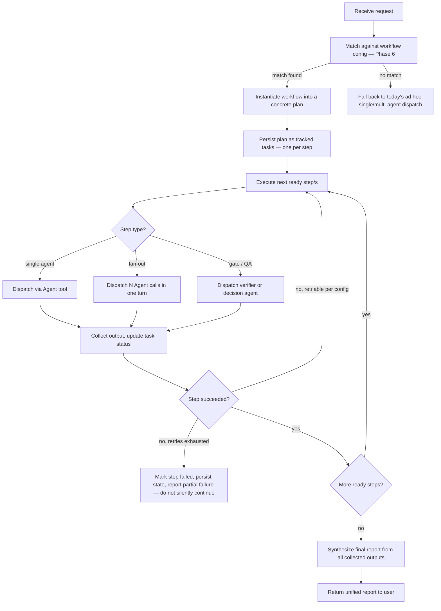

# Phase 4 — Roi as Workflow Orchestrator

Design goal: Roi stops being "a routing table Claude reads" and becomes "a planner that instantiates a workflow definition into a concrete, tracked, resumable execution" — while keeping everything Phase 2 identified as a strength (manager pattern, never doing the work himself, minimal tool grant, context-centric dispatch to unchanged specialist agents).

## 1. What does not change

- Roi never performs domain work himself. Every deliverable still comes from a specialist agent.
- The manager pattern is retained: Roi dispatches, collects, synthesizes, and always owns the final report. No permanent handoffs.
- Specialist agents (Liat, Noga, Merav, Dani, Yael, Gefen) are **not modified by this phase** — their personas, tool scopes, and internal logic are Phase 7's concern, not Phase 4's. This phase only changes how Roi *decides and tracks*, not what any specialist does once dispatched.
- "No new agents unless absolutely necessary" continues to apply to the orchestrator redesign itself — this phase does not propose a separate "orchestrator agent" distinct from Roi, a "scheduler agent," etc. One Roi, doing more.

## 2. The core gap this phase closes

Per Phase 2's audit: **Roi has no persistence.** Every dispatch is a fresh subagent instance with zero memory of any prior partial run. This single fact is *why* today's Roi can only be a router — a router doesn't need memory, it just needs to look at the current message and pick a target. Everything the user's brief asks for (monitoring, retries, resumability, execution logs, progress reporting) requires Roi to have **somewhere to write down what it's doing before it's done** — a plan that survives past the current turn.

**Concrete tool change required**: add `Write` and Claude Code's built-in task-tracking tools (`TaskCreate`, `TaskUpdate`, `TaskList`, `TaskGet`) to Roi's tool grant. Nothing else changes about his access (still no `Bash`, still no direct API/MCP access, still no content-generation capability) — this is the minimal addition that makes planning, monitoring, and resumability possible, and it reuses infrastructure Claude Code already provides rather than inventing a bespoke state store (see Phase 5 for why this specific choice was made over a custom JSON/database format).

## 3. Roi's new operating loop

### Step-by-step responsibilities, mapped to the user's Phase 4 requirements

| Requirement | How Roi satisfies it |
|---|---|
| Understand the user's objective | Unchanged — Roi's own reasoning, same as today, on the incoming request text. |
| Identify required deliverables | Read from the matched workflow config's declared `deliverables` (Phase 6 schema), not re-derived from scratch each time — deterministic where a template exists, reasoned where it doesn't. |
| Determine which agents are required | Deterministic lookup from the config's `steps[].agent` field — this is the ADK "Workflow Agent" idea: the *shape* of who's involved is data, not a fresh judgment call. |
| Build an execution plan | Instantiate the template's step graph with this request's specifics (topic, files, flags) substituted in. |
| Resolve dependencies | Read from the config's `steps[].depends_on` field (Phase 6) — an explicit dependency list per step, not inferred. |
| Determine parallel vs. sequential | Steps with no dependency on each other's *output* (only on the same upstream step) are dispatched together in one turn — this is the fan-out/fan-in primitive from Phase 1, made explicit rather than ad hoc. |
| Schedule execution | Roi walks the plan in dependency order, same turn-taking model Claude Code already uses for parallel `Agent` calls (multiple invocations in one response block). |
| Monitor progress | `TaskUpdate` after every step dispatch and every step completion — this is the literal, structural answer to "monitor progress," using infrastructure already available in this environment. |
| Collect outputs | Each specialist's returned report/file paths get attached to that step's task record. |
| Coordinate communication between agents | Unchanged in spirit — Roi still relays what one agent produced into the next agent's dispatch prompt (e.g., folding Dani's brief into Noga's prompt), just now informed by the plan's declared data-flow (`steps[].inputs_from`) instead of Roi having to remember to do it correctly from prose instructions. |
| Retry failed steps where appropriate | Config-declared retry policy per step (Phase 5/6) — bounded, and only for execution-class failures (tool/API errors, empty/malformed output), never for legitimate agent judgment outcomes. |
| Execute QA loops | A step can be typed `qa` in the config — dispatched with minimal context (the deliverable + the brief it must satisfy), blackbox-checking per Phase 1's verification-subagent pattern, non-blocking by default (matches existing project culture) unless the workflow explicitly marks the gate `blocking: true`. |
| Handle conditional branches | Config declares branch conditions keyed to **user input flags** (e.g. "images needed: y/n") or to a **named gate step's verdict** (e.g. Yael's fits/adjust/new-move) — see Phase 3's finding that no current workflow branches on anything else. |
| Recover gracefully from failures | On unrecoverable step failure: persist exact state (which steps done, which pending, which failed and why), report it plainly to the user rather than presenting a degraded result as if it were complete. |
| Produce a final execution report | Unchanged in spirit from today's "unified report," now additionally referencing the run's tracked tasks so the report is generated *from* the actual recorded execution, not reconstructed from Roi's short-term memory of the conversation. |

## 4. Resumability, concretely

Because the plan is persisted as tracked tasks (not just held in one conversation's context), a workflow interrupted mid-run — the user closes the session, or (per W7) the workflow spans a scheduled trigger and a later human approval — can be **resumed by a later Roi invocation** that:
1. Checks for an existing in-progress run matching the request (via `TaskList`/`TaskGet`), instead of assuming a clean slate.
2. If found, resumes from the first not-yet-completed step, skipping redundant re-execution of already-done steps.
3. If not found, starts a new plan as described above.

This generalizes W7's cross-session approval gate (today a one-off, hand-built pattern specific to the weekly email) into a property *any* workflow can have, by marking a step `awaits_human_approval: true` in its config (Phase 6) rather than it being special-cased in Roi's prose.

## 5. What this phase deliberately does not build

Consistent with Phase 1's governing constraint (multi-agent coordination costs 3–10x tokens; add complexity only where evidence supports it) and Phase 2's explicit warning against over-engineering:

- **No new standing "orchestrator" or "QA" agent.** QA loops are workflow steps that dispatch a lightweight, purpose-built verifier *inline*, not a permanent 8th team member.
- **No general-purpose scheduling engine beyond what already exists** (this environment's cron/scheduled-task tools, already used for the weekly email) — Phase 5 reuses that rather than building a parallel scheduling system.
- **No automatic retries on agent judgment.** A "needs adjustment" verdict from Yael, or a non-blocking note from Dani, is a correct and complete result — retry logic in this design only ever targets execution failures, never re-litigates an agent's actual answer.
- **No workflow branching on live free-form agent reasoning beyond the one case that already exists** (Yael's three-way gate). If future workflows need genuinely dynamic, reasoning-driven branching, that is an explicit config feature to add later (Phase 6's schema is designed to be extended, not to pre-build speculative branch types now).

## 6. Net effect on Roi's persona file

`roi.md` gains: a description of the plan→execute→monitor→report loop above, the new tool grants (`Write`, `TaskCreate`, `TaskUpdate`, `TaskList`, `TaskGet`) with the same "scoped and justified" documentation style already used for every other agent in this project (e.g. Dani's enumerated five Bash uses), and instructions to consult the workflow config (Phase 6) before falling back to ad hoc reasoning. It does **not** gain Bash, direct MCP/API tool access, or content-generation capability — the "Roi never does the work himself" boundary is unchanged and, if anything, reinforced by making the planning/tracking responsibilities explicit and separate from doing.
