# Phase 5 — Workflow Engine Design

Phase 4 defined *who* does the planning (Roi) and *what* it's responsible for. This phase defines the underlying mechanics: the state model, execution semantics, and lifecycle every workflow run follows — regardless of which specific workflow (Phase 3's catalog) is running.

## 1. Design constraint, restated

Per Phase 1's research and Phase 2's audit: this is not Temporal, and should not try to be. There is no separate server, no worker pool, no distributed persistence layer. A "run" of a workflow happens inside one or more Claude Code sessions, human-paced, with Roi as the single execution authority. The engine described below is a **set of conventions and a minimal state schema**, not a piece of running software — it is implemented as instructions in `roi.md` plus data in Claude Code's existing task-tracking primitives, not as a new codebase.

## 2. Why reuse `TaskCreate`/`TaskUpdate` instead of a bespoke state file

Three options were considered:
1. **A bespoke JSON/YAML state file per run** (e.g. `.claude/runs/<id>.json`), written and read via `Write`/`Read`. Fully controllable schema, but Roi would need to hand-roll parsing, and there's no existing viewer/list mechanism — reinventing infrastructure Claude Code already ships.
2. **An external database or queue** (as Temporal/Durable Functions do). Rejected outright per the Phase 1 constraint — disproportionate operational surface for a solo-operator, chat-driven system.
3. **Claude Code's built-in `TaskCreate`/`TaskUpdate`/`TaskList`/`TaskGet` tools** — already used throughout this very session to track the 9-phase project you're reading right now. Persistent within a project, structured (subject, description, status, metadata, blocking relationships), and supports `pending`/`in_progress`/`completed`/`deleted` natively, plus `addBlockedBy`/`addBlocks` to express dependencies. **Correction, added after live pilot validation** (`architecture/12-phase-e-live-validation-report.md`): those four values are *not* a one-to-one fit for every state §3 below describes (`failed`, `awaiting_approval`, `retry_pending` have no literal tool equivalent) — this was an overclaim at design time, corrected once tested. The actual, verified mapping from the designed states below onto these four real values, using `metadata` to carry the rest, is documented once, canonically, in `.claude/workflows/_schema.md` under "State mapping — designed states vs. real `TaskUpdate` capability." This section keeps the original conceptual model (§3) for readability; the schema doc is the source of truth for the real representation.

**Decision: option 3.** Each workflow step becomes one task; the workflow run itself is the set of tasks sharing a common run identifier (stored in each task's `metadata`). This is the direct, minimal-footprint answer to the engine's persistence needs, and it's why Phase 4 recommended adding these tools to Roi's grant rather than `Bash`+custom scripts.

## 3. Run and step state model

**Run-level states**: `planned` → `running` → (`paused_for_approval` ⇄ `running`) → `completed` | `failed` | `cancelled`.

**Step-level states — conceptual model.** This diagram is the *designed* vocabulary (what Roi reasons about); it is **not** a literal list of `TaskUpdate` status values. See `.claude/workflows/_schema.md`'s state-mapping table for exactly how each of these is actually recorded using the tool's real four-value `status` field plus `metadata`:

```mermaid
stateDiagram-v2
  [*] --> pending
  pending --> ready: all depends_on satisfied
  ready --> in_progress: Roi dispatches (Agent tool)
  in_progress --> completed: specialist returns success
  in_progress --> retry_pending: execution failure, retries remain
  retry_pending --> in_progress: re-dispatch
  in_progress --> failed: execution failure, retries exhausted
  in_progress --> awaiting_approval: step marked awaits_human_approval
  awaiting_approval --> in_progress: user approves (later session, resumed)
  completed --> [*]
  failed --> [*]
  cancelled --> [*]
  pending --> cancelled: run cancelled before step started
  in_progress --> cancelled: run cancelled mid-step (step allowed to finish if already dispatched; no new steps start)
```

A step is **`ready`** exactly when every step named in its `depends_on` list is `completed` (or, for a QA gate specifically, when the producing step is `completed` *and* the gate hasn't already run for this attempt).

## 4. Dependency graph & execution order

The graph is the config's `steps[]` list (Phase 6) plus each step's `depends_on`. Roi computes readiness the same way any topological-sort-based scheduler does: on each pass, dispatch every currently-`ready` step; steps with no unresolved dependency on each other are, by construction, independent and get dispatched **together in one turn** (Claude Code's native support for multiple `Agent` calls in a single response — already this session's own working pattern for e.g. Merav generating several images at once).

This directly implements:
- **Sequential execution**: step B `depends_on: [A]` — B isn't `ready` until A is `completed`.
- **Parallel execution / fan-out**: steps B and C both `depends_on: [A]`, and B/C have no dependency on each other — both become `ready` simultaneously and are dispatched together.
- **Fan-in**: a step D with `depends_on: [B, C]` isn't `ready` until *both* complete — Roi collects both outputs before dispatching D.

## 5. Conditional execution

Per Phase 3's finding (no current workflow branches on live free-form agent reasoning except Yael's gate), the engine supports exactly two branch mechanisms, deliberately not more:

1. **Input-flag branches**: a step's inclusion is gated by a boolean resolved from the request itself (e.g. `condition: needs_images`). Resolved once, at plan-instantiation time, by Roi's initial reasoning about the request — not re-evaluated mid-run.
2. **Gate-verdict branches**: a named step (typed `gate`) returns one of a declared set of verdicts (e.g. Yael: `fits | needs_adjustment | new_strategic_move`); downstream steps declare which verdict(s) they require to become eligible (e.g. the rest of the pipeline requires `fits`). A `needs_adjustment`/`new_strategic_move` verdict routes to a **surface-to-user** terminal step instead of silently blocking or silently proceeding — matching the existing, working W5 behavior exactly, just now expressed as data instead of being hand-coded into Roi's prose.

## 6. Retry policy

Declared per step in config (Phase 6), e.g. `retry: { max_attempts: 2, on: [tool_error, empty_output] }`. Scope, deliberately narrow per Phase 1's guidance:
- **Retries apply only to execution-class failures**: a tool/API error, a timeout, a response that fails basic shape validation (e.g. Dani's package missing a required field).
- **Retries never apply to a valid agent judgment** — Yael saying "needs adjustment" is a completed step with a real answer, not a failure.
- **No backoff/delay logic** — since execution is human-paced within a chat turn, immediate re-dispatch is sufficient; this is a deliberate simplification vs. Temporal's backoff machinery, justified by the scale difference (Phase 1).
- On exhaustion: step → `failed`, run does not silently continue past it — see §8.

## 7. QA feedback loops

A step typed `qa` runs *after* its target step completes, with **minimal context**: the deliverable plus the brief/criteria it must satisfy (per Phase 1's verification-subagent pattern — not the target step's full working context). Two modes, declared per workflow:
- **`blocking: false`** (default, matches the project's existing universal "non-blocking notes" culture — Dani's reviews, Gefen's reviews): QA output is attached to the final report as notes; the run proceeds regardless.
- **`blocking: true`** (opt-in, for future workflows where it's actually warranted, e.g. a real auto-publish step): a `fail` verdict routes back to the target step for **one bounded re-attempt** (loop-back edge, capped — never an unbounded QA↔fix loop), then either passes or halts the run for human review. No current cataloged workflow needs `blocking: true`; the mechanism exists for Phase 7/9's forward-looking capabilities (e.g. an eventual publish step).

## 8. Failure handling & partial-failure reporting

On any step reaching `failed`: Roi does not present the run as complete. The final report explicitly states which deliverables exist, which don't, and why — this is a direct fix for Phase 2's "silent partial failures" risk. The run's state (all task records) remains queryable (`TaskList`/`TaskGet`) for a later resume attempt (§10) rather than being discarded.

## 9. Timeout handling

Because there is no server process to enforce wall-clock timeouts, "timeout" here means: **a step declares an expected step count / turn budget** (advisory, e.g. `max_turns: 1` for a single dispatch-and-return step); if a dispatched specialist doesn't return within a reasonable bound, Roi treats it the same as an execution failure for retry purposes. This is intentionally lightweight — a full preemptive-timeout system (killing a running subagent mid-work) is not something Claude Code's `Agent` tool exposes control over today, so the engine designs around that constraint rather than assuming capability that doesn't exist.

## 10. Cancellation

A user saying "stop"/"בטל" mid-run is handled by Roi: mark the run `cancelled`, mark any `pending`/`ready`/`retry_pending` steps `cancelled` (not dispatched), leave any already-`in_progress` step to finish naturally (Claude Code has no hard-kill for a dispatched subagent), and report exactly what did/didn't complete. This is a **cooperative** cancellation model, not preemptive — the honest, achievable version given the platform's actual capabilities, rather than promising an interrupt semantic that can't really be delivered.

## 11. Resumable workflows

Formalizing Phase 4 §4: at the start of any request, before building a new plan, Roi checks `TaskList` for an existing run (matched by a stable identifier derived from the request context — e.g. same output filename target, same workflow type, status not `completed`/`cancelled`). If found: resume from the first non-`completed` step. If not found: instantiate fresh. This is the mechanism that generalizes W7 (weekly-email approval) to every workflow, per Phase 4.

## 12. Future scheduling

Entry point for scheduled/triggered runs (cron, webhook-via-Make) is unchanged from today's one working example (the weekly email's cron trigger) — this phase does not add a new scheduling subsystem, it documents the existing one as the pattern to reuse: an external trigger (this environment's scheduled-tasks mechanism, already in use) invokes a fresh Roi session with a specific, bounded instruction (mirroring the weekly email's explicit "preview only, don't dispatch production agents" constraint). Any future scheduled workflow follows the same shape: trigger → bounded Roi invocation → either completes inline or leaves a `paused_for_approval` run for a later human-initiated session to resume.

## 13. Execution logs & progress reporting

The task records themselves **are** the execution log — no separate logging system. `subject`/`description` document what each step is; `status` transitions are the timeline; `metadata` carries run-id, retry count, and (on failure) the error summary. Progress reporting to the user, mid-run, is simply: "steps completed: X of Y, currently running: Z" derived directly from `TaskList` — not a separate mechanism.
